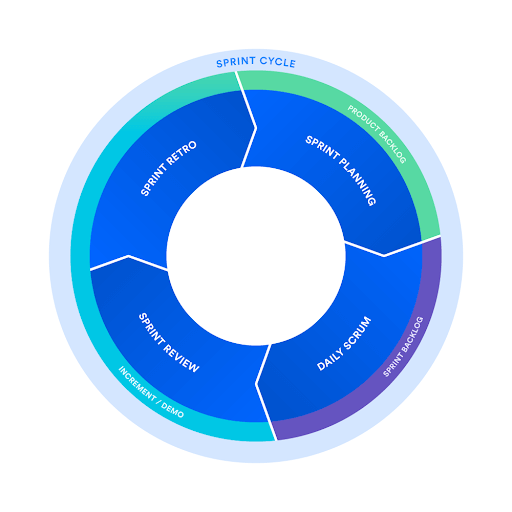

# Agile Note

Agile is an iterative approach to project management and software development that helps teams deliver value to their customers faster and with fewer headaches.

Instead of betting everything on a "big bang" launch, an agile team delivers work in small, but consumable, increments. Requirements, plans, and results are evaluated continuously so teams have a natural mechanism for responding to change quickly.

Agile is a group of methodologies.

Some agile frameworks: Scrum, Kanban, Lean, and Extreme Programming (XP). 

**The way each team practices agile should be unique to their needs and culture.**

Key points:

- clear communication
- transparency
- working iteratively
- delivering value to customers 
- embracing continuous improvement

---

## Scrum

Scrum is centered around continuous improvement, which is a core principle of agile.

### Three Artifacts

- Product Backlog: The master list of work that needs to get done maintained by the product owner or product manager.
  - The team’s "To Do" list. 
  - It is constantly revisited, re-prioritized and maintained by the Product Owner. 
- Sprint Backlog: The list of items, user stories, or bug fixes, selected by the development team for implementation in the current sprint cycle. 
  - Before each sprint, in the sprint planning meeting the team chooses which items it will work on for the sprint from the product backlog.
  - A sprint backlog may be flexible and can evolve during a sprint. 
  - The fundamental sprint goal – what the team wants to achieve from the current sprint – **CANNOT** be compromised.
- Increment (or Sprint Goal): The usable end-product from a sprint.

### Scrum Ceremonies or Events

1. Organize the backlog: The product owner maintains this list using feedback from users and the development team to help prioritize and keep the list clean.
2. Sprint planning: A meeting where the team decides on the sprint goal.
    - Led by the scrum master.
3. Sprint: The actual time period when the scrum team works together to finish an increment.  
    - Two-week is typical. Could be a week or a month.
    - The more complex the work and the more unknowns, the shorter the sprint should be.
    - During this period, the scope can be re-negotiated if necessary.
    - Once a certain time interval for a sprint is established, it has to remain consistent throughout the development period. 
4. Daily Scrum or Stand Up: A **daily** super-short meeting that happens at the same time (usually mornings) and the same place to keep it simple. 
    - Could be 15 minutes.
    - Goal: To make sure everyone on the team is on the same page, aligned with the sprint goal, and to get a plan out for the next 24 hours.
    - Voice any concerns you have.
    - Every team member answers three questions:
      - What did I do yesterday?
      - What do I plan to do today?
      - Are there any obstacles?
5. Sprint review: At the end of the sprint, the team gets together for an informal session to view a demo of, or inspect, the increment.
    - The development team showcases the backlog items that are now "Done" to stakeholders and teammates for feedback.
    - The product owner can decide whether or not to release the increment, although in most cases the increment is released.
6. Sprint retrospective: The team comes together to document and discuss what went well and what needs to be improved for the next time, and what did not work in a sprint, a project, people or relationships, tools, or even for certain ceremonies. 

### Three Essential Roles

- Product owner
  - Build and manage the product backlog.
  - Closely partner with the business and the team to ensure everyone understands the work items in the product backlog.
  - Give the team clear guidance on which features to deliver next.
  - Decide when to ship the product with a predisposition towards more frequent delivery.
  - **It is important that the product owner is an individual.**
- Scrum master
  - Coach teams, product owners, and the business on the scrum process.
  - As the facilitator-in-chief, he/she schedules the needed resources (both human and logistical) for scrum ceremonies.
- Development team
  - Usually five to seven members.
  - Forecast how much work they believe they can complete over the iteration using their historical velocity as a guide.