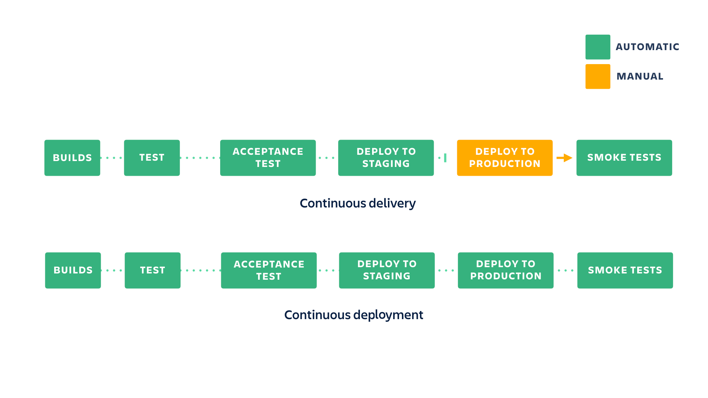
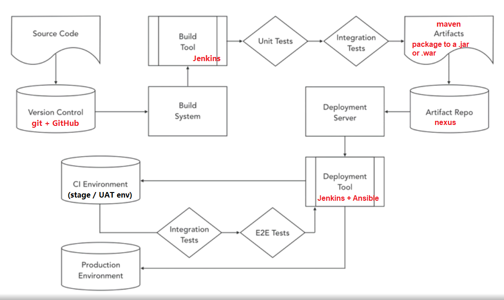

# CI / CD Note

- CI: Continuous Integration 
- CD: Continuous Delivery is the practice of making sure that your code is always ready to release even if you are not deploying every change to production. 
	- It is **recommended** to update your production as often as possible to make sure that you keep the scope of the changes small.

In continuous deployment, new changes pushed to the repository are automatically deployed to production if they pass the tests.

---

## Continuous Delivery VS. Continuous Deployment

Two strategies for the production deployment: 

- Using branches and pull requests: suited for teams that have special release branches that can be mapped to a deployment.
- Using custom pipelines and manual triggers: great for teams that are practicing trunk-based development.

---

## Build Pipeline & Flow

---

## Jenkins 

Complete integrated system automation:

[Building a Continuous Delivery Pipeline Using Jenkins](https://dzone.com/articles/building-a-continuous-delivery-pipeline-using-jenk)
