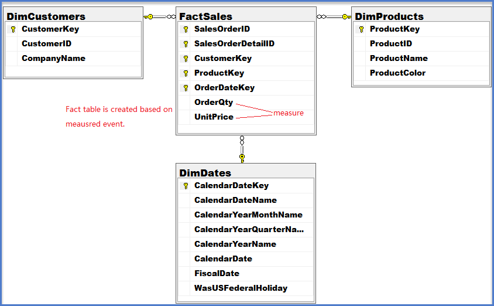
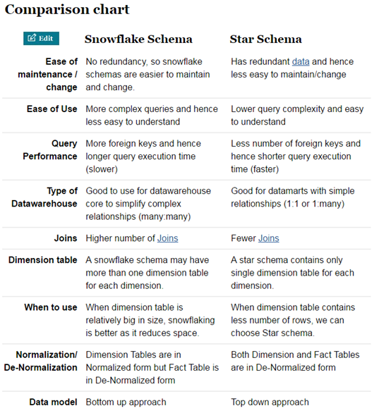
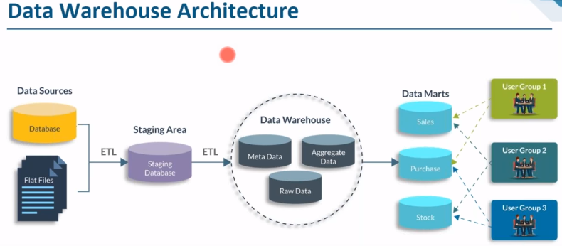
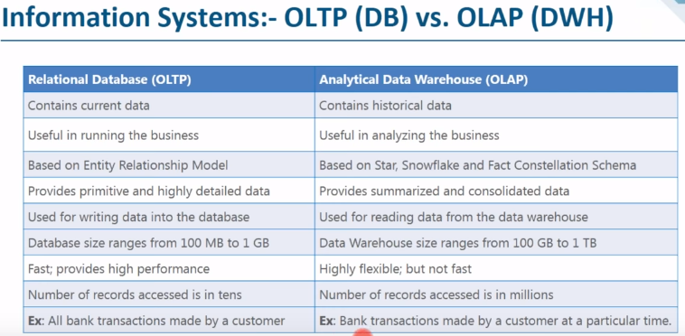
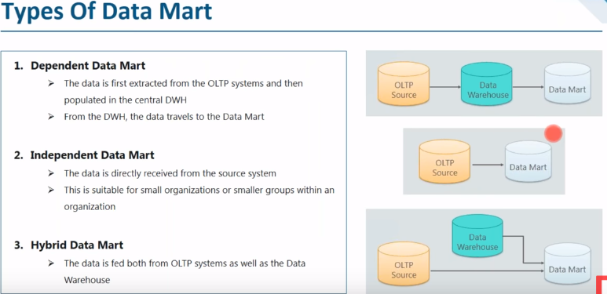

# Data Warehouse Note 

## Concepts

A data warehouse is a subject-oriented, integrated, time-variant, and nonvolatile collection of data in support of management's decision-making process.  

**Used for structured data storage.**

Data warehouse (DWH) is not loaded every time when new data is added into transaction database. 

There is no frequent updating done in a data warehouse.

A data warehouses provides us **generalized** and **consolidated** data in **multidimensional** view. 

A data warehouse system helps in consolidated historical data analysis.

A data warehouse is a database, which is physically stored and kept separate from the organization's operational database, not requiring transaction processing, recovery, and concurrency controls.

### Types of Data Warehouse

Three types of data warehouse applications:

- Information Processing: querying, basic statistical analysis, reporting using crosstabs, tables, charts, or graphs.
- Analytical Processing: basic OLAP operations, including slice-and-dice, drill down, roll up, and pivoting.
- Data Mining: knowledge discovery by finding hidden patterns and associations, constructing analytical models, performing classification and prediction.

### Pros & Cons

|  Pros  | Cons  |
|  ----  | ----  |
| Fast data retrieval | Costly to implement |
| Curated data sets  | Maintenance can be challenging |
| Centralized storage | Security concerns |
| Better business intelligence | Hard to scale to meet demand |

### Integrating Heterogeneous Databases

Two approaches: 

- Query-driven Approach :thumbsdown:
  - traditional approach 
  - inefficient
  - expensive for frequent queries
- Update-driven Approach :thumbsup:
  - high performance
  
### Metadata

Metadata is a road-map to data warehouse.

Metadata in data warehouse defines the warehouse objects.

Metadata acts as a directory that helps the decision support system to locate the contents of a data warehouse.

### Surrogate Key

Advantages:

- Natural key may be long, and not suitable for Indexing. 
- A single Integer surrogate key is able to save a substantial amount of storage space.
- Improve join performance, since joining two Integer columns works faster. 
- Fastening data retrieval and lookup in the ETL performance.

Disadvantages:

- Over usage of SKs lead to the problem of disassociation. 
- The generation and attachment of SK creates unnecessary ETL burden.

It is a **best practice** to create new **artificial surrogate key** values in the data warehouse tables, in addition to the original ID columns used to connect tables in the source database. 

### Fact Tables VS Dimension Tables

Fact tables can become extremely large. Often have over 100 columns, sometimes several hundred, trillions of rows and petabytes of data.

Dimension tables are usually much smaller (millions of rows).

### Schemas

#### Snowflake vs. Star Schema

The snowflake schema is similar to the star schema. However, in the snowflake schema, dimensions are normalized into multiple related tables, whereas the star schema's dimensions are denormalized with each dimension represented by a single table. 

**Star schemas are often preferred** because they are simpler for analysts to work with.

---

## Architecture

---

## OLAP

### OLTP vs. OLAP

**OLTP**

- OLTP (Online Transaction Processing) is where information systems facilitate and manage transaction-oriented applications, typically for data entry and retrieval transaction processing rather than for the purpose of business intelligence or reporting.  
- In OLTP database there is detailed and current data, and schema used to store transactional databases is the entity model (usually 3NF).

**OLAP**

- OLAP (Online Analytical Processing) is a technology that organizes large business databases and supports complex analysis. It can be used to perform ad hoc multi-dimensional analytical queries without negatively affecting transactional systems. 
- OLAP is characterized by relatively low volume of transactions. Queries are often very complex and involve aggregations. 
- Consist of three basic analytical operations: 
  - Consolidation (**roll-up**) - aggregation of data that can be accumulated and computed in one or more dimensions. For example, all sales offices are rolled up to the sales department or sales division to anticipate sales trends.
  - **Drill-down** - navigate through the details. For instance, users can view the sales by individual products that make up a region's sales. 
  - **Slicing and dicing** - users can take out (slicing) a specific set of data of the OLAP cube and view (dicing) the slices from different viewpoints.
- Core of OLAP: **multidimensional** cube. 
- View selection problem: The problem of deciding which aggregations (views) to calculate. 
  - Because usually there are many aggregations that can be calculated, often only a predetermined number are fully calculated; the remainder are solved on demand. 
  - The objective of view selection is typically to minimize the average time to answer OLAP queries. 

---

## Data Marts

Small version of data warehouse which deals with a single subject, focuses on one area, is customized by department.  

The implementation cycle of a data mart is measured in short periods of time, i.e., in weeks rather than months or years.

---

## Data Lakes

Data lakes extend data warehouses.

Data lakes provide customers a means for including **unstructured** and **semi-structured** data in their analytics.