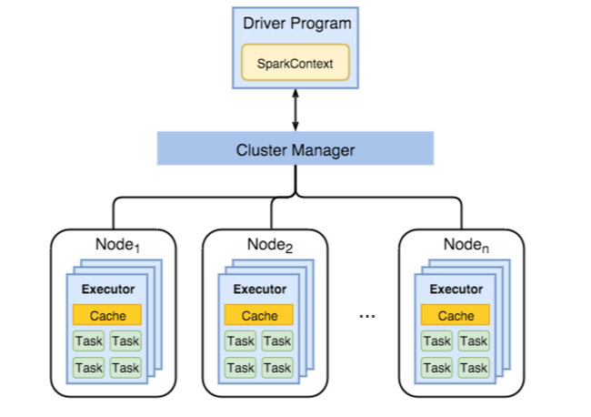
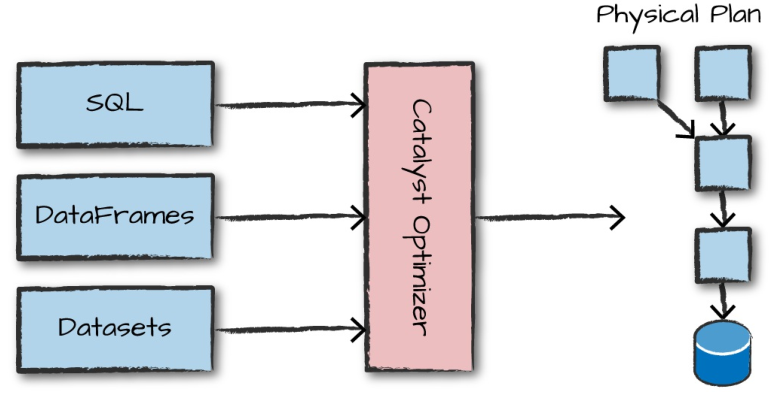
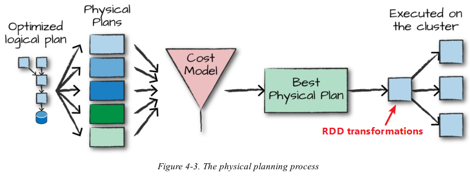
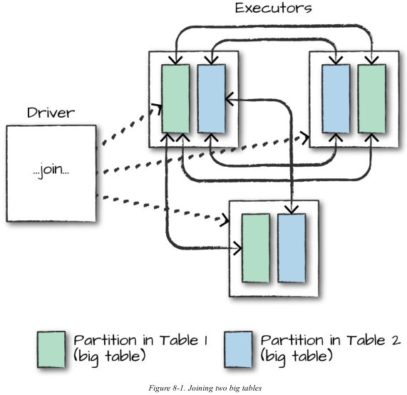
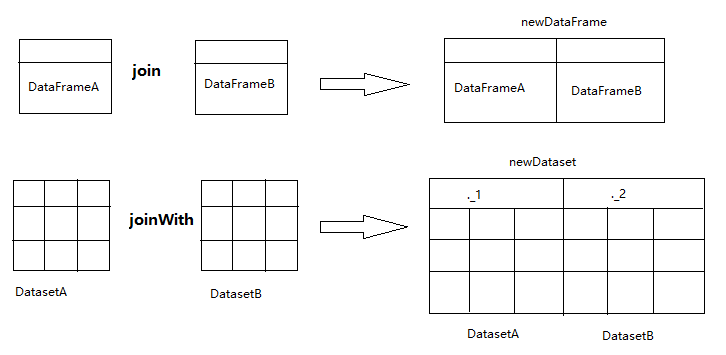

# Spark Note

Apache Spark is a fast and general-purpose distributed / cluster computing system. It provides high-level APIs in Java, Scala, Python and R, and an optimized engine that supports general execution graphs. It also supports a rich set of higher-level tools including Spark SQL for SQL and structured data processing, MLlib for machine learning, GraphX for graph processing, and Spark Streaming.

## Spark Core

### Architecture  

A Job includes multiple RDDs.

A RDD can be broken into multiple Stages.

A Stages get broken into multiple Tasks that are distributed to nodes on the cluster and then executed.




There is a **BlockManager** storage module in **Executor**, which uses both RAM and disk as storage devices in order to reduce IO overhead effectively.

When executing an application, Driver will apply resources from Cluster Manager, start up Executors, send program code and files to Executors, and then execute Tasks on Executors.


---

### Cluster Resource Manager

- Standalone
- Yarn
- Mesos
- Kubernetes

Spark built-in cluster resource manager (standalone) is not easy to use. It is more limited than other cluster managers. The cluster can only run Spark. **DO NOT** use it generally.

Mesos integrates with Spark better than Yarn.

You can use Mesos and Yarn at the same time. Mesos is for **coarse-grained** management allocating resource to Docker, and then Yarn is for **fine-grained** management.

---

## Deployment of Spark Applications

[Spark Modes of Deployment – Cluster Mode and Client Mode](https://techvidvan.com/tutorials/spark-modes-of-deployment/)

---

### Life Cycle of a Spark Application

#### Outside Spark (cluster mode)

1. Client Request
    1. You submit an application executing code on your local machine through `spark-submit`.
    2. Make a request to the cluster manager driver node explicitly asking for resources for the Spark driver process only.
    3. Cluster manager places the driver process onto a node in the cluster.
    4. The client process exits and application is off and running on the cluster.
2. Launch
    1. The driver process runs user code on the cluster including a SparkSession that initializes a Spark cluster.
    2. The SparkSession communicates with the cluster manager asking it to
launch Spark executor processes across the cluster.
    3. The cluster manager responds by launching the executor processes and sends the relevant information about their locations to the driver process.
3. Execution
    1. The driver and the workers communicate among themselves, executing code and moving data around.
4. Completion
    1. The driver process exits with either success or failure.
    2. The cluster manager then shuts down the executors.
    3. You can see the success or failure of the Spark Application by asking the cluster manager.
 
#### Inside Spark 

1. Create a SparkSession (the first step of any Spark Application).
2. Execute code.

1 data block - 1 partition - 1 Spark task - runs on 1 executor

---

### RDDs

- A RDD (Resilient Distributed Dataset) is essentially a **read-only** partition record set.
- Each RDD can be divided into multiple partitions. Each partition is a dataset fragment. Each partition can be stored on different nodes in the cluster. (parallel computing)
- Virtually everything in Spark is built on top of RDDS.
- One thing that you might use RDDs for is to parallelize raw data that you have stored in memory on the driver machine. For instance, `spark.sparkContext.parallelize(Seq(1,2,3)).toDF()`.

#### Partitioning

Get partition number of a Dataset or DataFrame: `<dataset_or_dataFrame>.rdd.partitions.size`.

##### Partitioning Rule

- The number of partitions should be equal to the number or its integer multiple of CPU cores in the cluster as possible.
- Each partition is generally between 100 - 200 MB.

##### Default Partition Number

Configure default partition number through set the parameter `spark.default.parallelism`.

- Local model: Number of CPU of local machine. If `local[N]` has been set, default partition number is N.
- Mesos: 8.
- Standalone or Yarn: Max value between number of CPU cores in the cluster and 2.

##### Manually Configure Partition

RDD partitioning is automatic but can be done manually through programming.

- When creating a RDD using `textFile()` or `parallelize()` methods, specify it. For example, `sc.textFile(<path>, <partitionNum>)`.
  - By default, Spark creates one partition for each block of the file (blocks being 128MB by default in HDFS).
  - You cannot have fewer partitions than blocks.
- When getting a new RDD by transformation, invoke `repartition(<partitionNum>)` method. For example, `rdd2 = rdd1.repartition(4)`. 4 partitions.
  - Check number of partitions: `rdd2.partitions.size`.

##### Stage Division & Dependencies

- Narrow dependencies: The relationship between RDDs is 1 : 1 or many : 1.
- Wide dependencies: The relationship between RDDs is 1 : many or many : many.

Create a new stage when it comes across wide dependencies.


Optimize for dependencies:  

- Do as many narrow dependencies together before hitting a wide dependency.  
- Try to group wide dependency transformations together, possibly inside a single function and do it once.  

#### RDD Running Process


#### Printing Elements of an RDD

It is common to print out the elements of an RDD using `<rdd_var>.foreach(println)` or `<rdd_var>.map(println)`.

- On a single machine, OK.
- In cluster mode, the methods called by executors will print output on executors rather than the driver.

To print all elements on the driver, you may use collect all RDDs to the driver firstly and then print: `<rdd_var>.collect().foreach(println)`.

- This will cause the driver to run out of memory.
- Thus, only print a few elements for testing: `<rdd_var>.take(<number_of_elements>).foreach(println)`.

---

### Datasets

Datasets and DataFrames are distributed table-like collections with well-defined rows and columns.

- After Spark 2.0, RDDs are replaced by Datasets. The RDD interface is still supported. **The trend in Spark is to use RDDs less and Datasets more.**
- Datasets are similar to RDDs but are **strongly typed** that mapped to relational schema.
- Datasets can explicitly wrap a given struct or type. (Dataset[Person], Dataset[(String, Double)])
- The Dataset API gives users the ability to assign a Java/Scala class to the records within a DataFrame and manipulate it as a collection of typed objects.
- **Recommend** using Datasets only with user-defined encoding surgically and only where it makes sense. This might be at the beginning of a big data pipeline or at the end of one.

#### Advantages

- Datasets are more efficient.
  - They can be serialized very efficiently, even better than Kryo.
  - Optimal execution plans can be determined at compile time.
- Datasets allow for better interoperability.
  - MLLib and Spark Streaming are moving toward using Datasets instead of RDDs for their primary API.  
- Datasets simplify development.
  - You can perform most SQL operations on a dataset with one line.

Processing or transmitting over the network:

- RDD: using Java serialization or Kryo.
- Dataset: using a specialized Encoder to serialize the objects.
  - This Encoder is highly optimized and generates bytecode at run time for serialization and deserialization.

Two ways to create a Dataset:

- from Hadoop InputFormats (such as HDFS files).
- by transforming other Datasets.

RDDs can be converted to Datasets with `.toDF()`.


#### Disadvantages

- Cost of performance: Spark converts the Row format (domain specifies type) to the object you specified (a case class or Java class).
- By specifying a function, you are forcing Spark to evaluate this function on every row in your Dataset. This can be very resource intensive. For simple filters it is always **preferred** to write
SQL expressions.

---

### DataFrames 

- A DataFrame simply represents a table of data with rows and columns. 
- A DataFrame is a kind of distributed dataset on basis of RDD.
- A DataFrame is a distributed set of `Row` objects or Dataset of type Row (`Dataset[Row]`).
- Each `Row` object represents a row of record, which provides detailed schema info.
- `Row` is an untyped JVM object.
- Through DataFrame, Spark SQL is able to know column name and type of the dataset.
- When you are using DataFrames, you are taking advantage of Spark's optimized internal Catalyst format. 
- Can be created from:
  - structured data files
  - Hive tables
  - external databases
  - existing RDDs: `val myDF = spark.createDataFrame(myRDD, mySchema)`

#### RDD VS DataFrame VS Dataset


- DataFrame maps to a collection of Row-type objects. 
- Dataset maps to a collection of objects. 
- DataFrames schema is inferred at **runtime**; but a Dataset can be inferred at **compile time**.
  - faster detection of errors and better optimization

---

### RDD -> DataFrame


Two ways to convert RDD to DataFrame:

- Use Reflection to infer the schema of the RDD that contains specific type data.
  - Firstly define a case class. Then Spark will convert it to DataFrame implicitly.
  - This way is suitable for the RDD whose data type is known.
  - More concise code.
  - Currently (Spark 2.4), Spark SQL does not support converting JavaBeans to DataFrames that contain Map field(s).
- Use programming interface to construct a schema and apply it to an existing RDD.
  - Construct Datasets when the columns and their types are not known until runtime.
  - More verbose.
  - Steps:
    1. Create an RDD of `Rows` from the original RDD.
    2. Create the schema represented by a `StructType` matching the structure of Rows in the RDD created in Step 1.
    3. Apply the schema to the RDD of `Rows` via `createDataFrame()` method provided by `SparkSession`.

---

### Structured API Execution

Steps: 

1. Write DataFrame / Dataset / SQL Code.
2. If valid code, Spark converts this to a Logical Plan.
3. Spark transforms this Logical Plan to a Physical Plan, checking for optimizations along the way through Catalyst Optimizer.
4. Spark then executes this Physical Plan (RDD manipulations) on the cluster.



#### Logical Plan


#### Physical Plan 



#### Execution

Spark performs further optimizations at runtime, generating native Java bytecode that can remove entire tasks or stages during execution.

---

### Schema

- Schema-on-read
  - Infer schema automatically.
  - Inaccurate, precision issues.
- Define schema manually through StructType and StructField
  - Use this in production especially for untyped sources like CSV and JSON files.

#### Column

Different ways to construct or refer a column: 

- `col("columnName")`
- `column("columnName")`
- `$"columnName"` (in Scala)
- `'columnName` (in Scala)
- `expr("columnName")` (the most flexible)

- Columns are just expressions.
- Columns and transformations of those columns compile to the same logical plan as parsed expressions. For example, `expr("columnName - 5")` = `expr("columnName") - 5`, because Spark compiles these to a logical tree specifying the order of operations.

#### Row

- Each row in a DataFrame is a single record.
- A record is an object of type Row.
- Row objects internally represent arrays of bytes. 

- Create a Row: `val myRow = Row("hello", null, 1, false)`
- Access a Row: 
  - `myRow(0)`: type Any
  - `myRow(0).asInstanceOf[String]`: type String
  - `myRow.getString(0)`: type String
  - `myRow.getInt(2)`: type Int

---

### Joins

Communication Strategies

- Shuffle join
  - All-to-all communication.
  - Every node talks to every other node. 
  - Expensive, especially if your data is not partitioned well.
- Broadcast join
  - Replicate the small DataFrame onto every worker node.
  - More efficient.
  - Explicitly use a broadcast join: `<df1>.join(broadcast(<df2>), <joinExpr>)`.

#### Big table–to–big table

Use shuffle join.



#### Big table–to–small table

Small: small enough to fit into the memory of a single worker node. 

Use broadcast join.

Steps:

1. Use broadcast variable to broadcast small table onto every node.
2. Joins will be performed on every single node individually. No further communication between nodes.


#### Small table–to–small table

It is usually best to let Spark decide how to join them.

### `joinWith()`

DatasetA `joinWith` DatasetB end up with two nested Datasets. Each column represents one Dataset. 

#### `join()` VS `joinWith()`



DataFrames can also join Datasets.

---

### Shared Variables

#### Broadcast Variables

- Use `SparkContext.broadcast(<var>)` to create a broadcast variable from a normal variable, which is cached on each machine.
- The broadcast variable is like a wrapper of its corresponding normal variable.
- The broadcasted data is cached in serialized form and deserialized before running each task.
- After the broadcast variable is created, it should be used instead of the original normal variable in any functions run on the cluster.
- All functions in the cluster can access the broadcast variable, thereby you do not need to repeatedly send the original normal variable to all nodes.
- After creating the broadcast variable, the original normal variable cannot be modified (is **read-only**). Consequently, the broadcast variable on all nodes are the same.
- **When to use**: when a very large variable need to be used repeatedly.

For instance,

1. Create: `val broadcastVar = sc.broadcast(Array(1,2,3))`
2. Get value: `broadcastVar.value`

#### Accumulators

- Used for counter and sum functions.
- Create: `<accum_var> = SparkContext.longAccumulator()` or `<accum_var> = SparkContext.doubleAccumulator()`
- Use: `<accum_var>.add(<number>)`
- These accumulators are available on Slave nodes, but **Slave nodes cannot read them**.
- Master node is the only one that can read and compute the aggregate of all updates. `<accum_var>.value`
- Spark natively supports accumulators of numeric types, and programmers can add support for new types.

For instance,

1. Create: `val nErrors=sc.accumulator(0.0)`
2. Load file: `val logs = sc.textFile("/Users/akuntamukkala/temp/output.log")`
3. Count number of "error": `logs.filter(_.contains(“error”)).foreach(x => nErrors += 1)`
4. Get value: `nErrors.value`

##### Accumulator Update

- For action operations, accumulator updates in each task will only be applied once even if the task restarts.
- For transformation operation, each task’s update may be applied more than once if tasks or job stages are re-executed.

---

### Caching / Persisting

- By default, each transformed RDD may be recomputed each time you run an action on it.
- Cache or persist datasets in memory on nodes.
- Future actions are faster (often by more than 10x).
- `<rdd_var>.cache()` for default storage level - `MEMORY_ONLY`.
- Or `<rdd_var>.persist()` with a specified StorageLevel parameter.
- Spark removes cached data automatically in a least-recently-used (LRU) fashion.
- Or use `<rdd_var>.unpersist()` if you want manually.

When to cache data:

- When doing data validation and cleaning.
- When querying a small “hot” dataset.
- Cache for iterative algorithm like PageRank.
- Generally, **DO NOT** use for input data as input data is too large.

#### Storage Level

- `MEMORY_ONLY` is the 1st choice.
- `MEMORY_ONLY_SER` is the 2nd choice. (Java and Scala)
- **DO NOT** use disk unless computing datasets are expensive, or amount of the data is large. Recomputing a partition may be as fast as reading it from disk.

---

### Shuffle

A shuffle represents a physical repartitioning of the data.

- Shuffle moves data across worker nodes, which is costly.
- It involves disk I/O, data serialization, and network I/O.
- It generates a large number of intermediate files on disk.
- By default, when we perform a shuffle, Spark outputs 200 shuffle partitions. You can specify it through `spark.conf.set("spark.sql.shuffle.partitions", "<number_of_shuffle_you_want>")`.
- Use minimal shuffle as possible and do them in late stages for better performance.  
- **DO NOT** use `groupByKey() + reduce()` if you can use `reduceByKey()`.
  - `groupByKey()` does not receive functions as parameter. When invoking it, Spark will move all key-value pairs, which will result in big overhead and transmission delay.

No shuffle transformations:  

- map
- filter  
- flatMap
- mapPartitions  
- ...

Shuffle transformations:  

- distinct  
- groupByKey  
- reduceByKey
- join  
- countByValue
- ...

---

### UDFs

Spark will serialize the UDF on the driver and transfer it over the network to all executor processes.

If the function is written in Scala or Java,

- little performance penalty. 
- performance issues if you create or use a lot of objects.

If the function is written in Python,

1. Spark starts a Python process on the worker, serializes all of the data to a format that Python can understand.
2. Executes the function row by row on that data in the Python process.
3. Returns the results of the row operations to the JVM and Spark.

Starting this Python process and serializing the data to Python are expensive. **Recommend writing UDFs in Scala or Java.**

**Best practice**: define the return type for the UDF when you define it.

---

### Lazy Evaluation

Taking advantage of lazy evaluation:  

- Do as many transformations as possible before hitting an action.  
- Avoid debugging statements with shuffle, e.g. printing counts.  

---

### API


The difference between `foreach()` and `map()`:

- `foreach()`: return void or no return value.
- `map()`: return dataset object.

---

### Data Sources

Six core data sources:

- csv
- json
- parquet
- orc
- jdbc/odbc connections
- plain-text files

When reading and writing, Spark will use the Parquet format **by default**.

When writing, the destination directory is actually a folder with numerous files within it, which reflects the number of partitions in our DataFrame at the time we write it out.

#### JSON

**Recommend** using line-delimited JSON format, which is much more stable than the multiline.

#### Parquet

**Recommend** writing data out to Parquet for long-term storage because reading from a Parquet file will always be more efficient than JSON or CSV.

Advantages: 

- Storage optimizations, columnar compression.
- When reading, it allows for reading individual columns instead of entire files.
- Supports complex types (array, map, struct), which would fail with a CSV file.

**Be careful** when you write out Parquet files with different versions of Spark (especially older ones) because this can cause significant headache.

#### ORC

A self-describing, type-aware columnar file format designed for Hadoop workloads.

- optimized for large streaming reads
- finding required rows quickly

Difference between ORC and Parquet:

- Parquet is further optimized for Spark.
- ORC is further optimized for Hive.

#### Text Files

- When reading, each line in the file becomes a record in the DataFrame.
- When writing, be sure to have only one string column; otherwise, the write will fail.

#### Advanced I/O Concepts

- **Recommend** Parquet with gzip compression.
- Multiple executors cannot read from the same file at the same time.
- By default, one file is written per partition of the data.

#### Small File Problem

When you are writing lots of small files, there is a significant metadata overhead that you incur managing all of those files.

Spark and HDFS do not work well with small files.

When writing files, you can control file sizes by controlling the number of records that are written to each file: `<columnName>.write.option("maxRecordsPerFile", <numberOfRecords>)`. 

---

## Spark SQL

- Use RDD to process text file.
- Use Spark SQL to process structured data.
- Spark SQL is intended to operate as an OLAP not OLTP.

### Spark SQL CLI

- Cannot communicate with the Thrift JDBC server.
- To start Spark SQL CLI, in terminal under the Spark directory, `./bin/spark-sql`.

---

### Spark SQL Thrift JDBC/ODBC Server


---

### SparkSession

From Spark 2.0, `SparkSession` interface was introduced to realize all functions of `SQLContext` and `HiveContext`.

Using `SparkSession`, you can

- load data from different data source and transfer to DataFrame.
- transfer DataFrame to table in `SQLContext`.
- use SQL statements to operate data.

#### SparkContext

SparkContext focuses on more fine-grained control of Spark’s central abstractions.

You should not need to explicitly initialize a SparkContext through `new SparkContext`, but use the following way:

```scala
import org.apache.spark.SparkContext
val sc = SparkContext.getOrCreate()
```

**You should never need to use the SQLContext.**

#### SQLContext

SQLContext focuses on the higher-level tools like Spark SQL.

**You should rarely need to use the SparkContext.**

---

### Spark SQL & Hive

It is compulsory to add Hive support for Spark in order to access Hive using Spark.

Pre-compile version Spark from official site generally does not contain Hive support. You need to compile the source code.

Spark SQL can connect to Hive metastores. To connect to the Hive metastore, there are several properties that you will need to specify.

---

### Catalog

The highest level abstraction in Spark SQL.

It is an abstraction for the storage of metadata about the data stored in your tables, databases,
tables, functions, and views.

---

### Tables

Core difference between tables and DataFrames:

- You define DataFrames in the scope of a programming language.
- You define tables within a database.

#### Spark-Managed Tables

- When you define a table from files on disk, you are defining an **unmanaged table**.
- When you use `saveAsTable` on a DataFrame, you are creating a **Spark-managed table**.

---

### Views

- A view specifies a set of transformations on top of an existing table. 
- It basically just saves query plans, which can be convenient for organizing or reusing your query logic.
- Spark will perform it only at query time.

---

### Aggregations

[SparkSQL 中group by、grouping sets、rollup和cube方法详解](https://www.jianshu.com/p/45cf609f5a61)

---

## Spark ML

- Machine learning algorithms in MLlib require that data is represented as numerical values. 
- All machine learning algorithms in Spark take as input a Vector type, which must be a set of numerical values. 

### ML Workflow

Steps: 

1. Data preprocessing: prepare **trainDataFrame** and **testDataFrame** based on raw data without using any ML concepts.
2. Data processing: feature engineering and get **transformation pipeline**. 
3. Prepare for training.
    1. Transformation pipeline fits trainDataFrame to get **fitted pipeline**.
    2. Fitted pipeline transforms trainDataFrame to get **transformedTraining**.
4. Cache transformedTraining.
5. Prepare for ML model.
    1. Create **untrained model**.
    2. Untrained model fits transformedTraining to get **trained model**.
    3. Trained model computes cost of transformedTraining.
6. Test.
    1. Fitted pipeline transforms testDataFrame to get **transformedTest**.
    2. Trained model computes cost of transformedTest.

Estimator receives an input DataFrame via `.fit()` method, and then generate a Transformer.

- Estimator: algorithm
- Transformer: model


- Red frame: estimator
- Blue frame: transformer

1. Create a new pipeline to fit trainingData, and then generate a pipelineModel.
2. Use this model to transform testData, and then get DataFrame with prediction.


---

### Feature Transformation

Feature transformation: transformation of label and index.

`StringIndexer`

- Construction order of the index is the frequency of label.
- When encoding labels, give priority to those with higher frequency.
- The index of the label with highest frequency is 0.

---

## System Scaling

### Scale Kafka Connect  

- Configure `tasks.max` to number of tables/files.  
- Create different instances for different tables/files.  
- Increase frequency of polling.  
- Use Kafka Connect in cluster mode.  

### Scale Kafka Broker  

- Create multiple partitions for each topic.  
- Increase nodes in the cluster.  

### Scale Spark Streaming  

- Have a single instance of the drive program with separate threads for each stream in the driver.  
- Create separate driver instances for each stream.
- Spark cluster – add nodes.  

### Scale MySQL

- Keep table size small, thereby keeping the entire table in memory, which makes updates and querying very quick.
- Use distributed databases with a lot of nodes that are good for frequent updates – e.g. Cassandra. 

---

## Spark Ecosystem


---

## Features & Versions

- Write Ahead Logs (WAL): introduced in Spark Streaming 1.2.
- Direct approach of Spark Streaming and Kafka integration: introduced in Spark 1.3.
- `SparkSession` interface: introduced in Spark 2.0.
- Dataset: introduced in Spark 1.6.
  - After Spark 2.0, RDDs are replaced by Dataset, which is strongly-typed like an RDD. The RDD interface is still supported.
- Continuous Processing: introduced in Spark 2.3.
- Watermarking: introduced in Spark 2.1. Allows the user to specify the threshold of late data, and allows the engine to accordingly clean up old state.

---

## Glossary

- **Avro**: Avro format is great for **row oriented data**. The schema is stored in another file.
- **Parquet**: It is a very efficient format. Generally, you take .csv or .json files. Then do ETL. Then write down to parquet files for future analysis. Parquet is great for **column oriented data**. The schema is in the file.  

---

## Useful Resources

- [A Tale of Three Apache Spark APIs: RDDs vs DataFrames and Datasets](https://databricks.com/blog/2016/07/14/a-tale-of-three-apache-spark-apis-rdds-dataframes-and-datasets.html)

---

## Reasons for Using Spark

- Spark's simple, robust programming model makes it easy to apply to a large number of problems. 
- There are also a lot of packages created by Spark community. 
