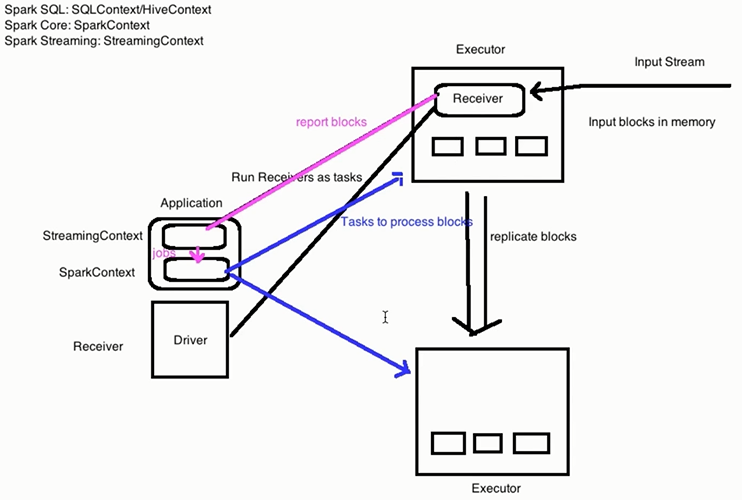

# Spark Streaming Note

## DStream API

Spark streaming is not real stream computing. It is second level.

If you want millisecond level, use stream computing framework, e.g. Storm.  


### DStream API Coding Steps


---

### DStream API Working Principle 




---

### Limitations

- Based purely on Java/Python objects and functions. Limits the engine’s opportunity to
perform optimizations.
- Purely based on processing time. To handle event-time operations, applications need to implement them on their own.
- Only operates in a micro-batch fashion, making it difficult to support alternative execution modes.

---

## Continuous VS Micro-Batch Processing

Continuous processing:

- The processing happens on each individual record.
- :thumbsup: Offers the lowest possible latency.
- :thumbsdown: Lower maximum throughput.
- :thumbsdown: Has a fixed topology of operators that cannot be moved at runtime without stopping the whole system, which can introduce load balancing issues.

Micro-Batch processing:

- :thumbsup: High throughput per node, so needs fewer nodes.
- :thumbsup: Uses dynamic load balancing techniques to handle changing workloads. 
- :thumbsdown: Higher latency. 

Which one to use: consider about latency and total cost of operation. 

---

## Structured Streaming

Built on the Spark SQL engine.

The **best thing** about Structured Streaming is that it allows you to rapidly and quickly extract value out of streaming systems with virtually no code changes. You simply write a normal DataFrame (or SQL) computation and launch it on a stream. You do not need to maintain a separate streaming version of their batch code.

- Micro-batch processing: 100 milliseconds latencies, **exactly-once** guarantees.
- Continuous processing: 1 millisecond latencies, **at-least-once** guarantees. (since Spark 2.3)

Mechanism: Treats a live data stream as an unbounded input table that is being continuously appended. The job then periodically checks for new input data, process it, updates some internal state located in a state store if needed, and updates its result.


Event-time: The time embedded in the data itself.

Compared with DStreams API, perform better due to: 

- code generation
- Catalyst optimizer

### Watermarking

- It lets the engine automatically track the current event time in the data and attempt to clean up old state accordingly.

- You can define the watermark of a query by specifying the event time column and the threshold on how late the data is expected to be in terms of event time.
- For example, `words.withWatermark("timestamp", "10 minutes").groupBy(window($"timestamp", "10 minutes", "5 minutes"), $"word").count()`.  Late data within 10 mins will be aggregated, but data later than 10 mins will start getting dropped. But it is not guaranteed to be dropped; it may or may not get aggregated.

Conditions for watermarking to clean aggregation state:

- Output mode must be **Append** or **Update**.
- The aggregation must have either the event-time column, or a "window" on the event-time column.
- `withWatermark()` method must be called on the same column as the timestamp column used in the aggregate. For example, `df.withWatermark("time", "1 min").groupBy("time2").count()` is invalid.

---

### Join Operations

Stream-stream Joins

- Introduced in Spark 2.3.
- For both the input streams, we buffer past input as streaming state, so that we can match every future input with past input and accordingly generate joined results.
- Similar to streaming aggregations, we automatically handle late, out-of-order data and can limit the state using watermarks.
- [Inner Joins with optional Watermarking](https://spark.apache.org/docs/latest/structured-streaming-programming-guide.html#inner-joins-with-optional-watermarking)
- [Outer Joins with Watermarking](https://spark.apache.org/docs/latest/structured-streaming-programming-guide.html#outer-joins-with-watermarking)
- If any of the two input streams being joined does not receive data for a while, the outer (both cases, left or right) output may get delayed.

As of Spark 2.3,

- you can use joins only when the query is in Append output mode.
- you cannot use other non-map-like operations before joins.

---

### Streaming Deduplication

You can deduplicate records in data streams using a unique identifier in the events.

```scala
val streamingDf = spark.readStream. ...  // columns: guid, eventTime, ...

// Without watermark using guid column
streamingDf.dropDuplicates("guid")

// With watermark using guid and eventTime columns
streamingDf
  .withWatermark("eventTime", "10 seconds")
  .dropDuplicates("guid", "eventTime")
```

---

## How to use spark-submit to run spark application script （for real projects）

Take processing socket text as an example.

Steps: 

1. In terminal A, run a Netcat server `nc -lk 9999`.
2. In terminal B, run spark script.

```
spark-submit --master local[2] \
--class org.apache.spark.examples.streaming.NetworkWordCount\
--name NetworkWordCount \
/usr/local/spark/examples/jars/spark-examples_2.11-2.3.0.jar localhost 9999
```

3. In terminal A, type `a a a b b c`.
4. In terminal B, you will see 

```
(a,3)
(b,2)
(c,1)
``` 

---

## How to use spark-shell to run spark application script （for testing）

Take processing socket text as an example. 

Steps: 

1. In terminal A, run a Netcat server `nc -lk 9999`.
2. In terminal B, `spark-shell --master local[2]`.
3. In terminal B, run spark script.

```scala
import org.apache.spark.streaming._
val ssc = new StreamingContext(sc, Seconds(1)) 
val lines = ssc.socketTextStream("localhost", 9999)
val words = lines.flatMap(_.split(" "))
val wordCounts = words.map(x => (x, 1)).reduceByKey(_ + _)
wordCounts.print()
ssc.start()
ssc.awaitTermination()
```

4. In terminal A, type `a a a b b c`.
5. In terminal B, you will see 

```
(a,3)
(b,2)
(c,1)
``` 